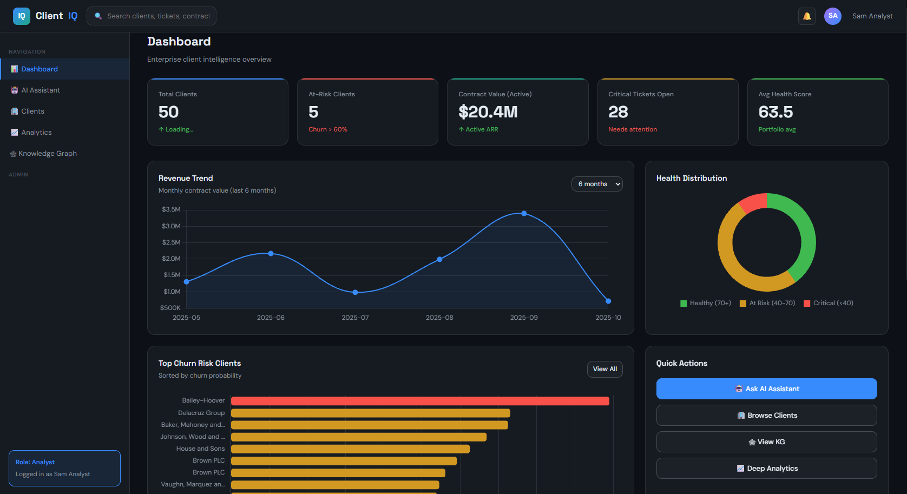
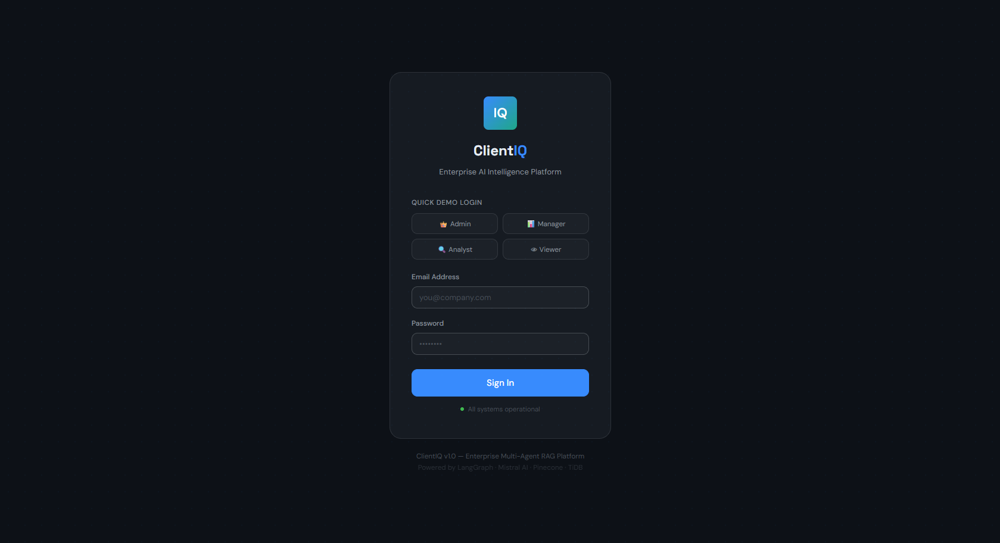
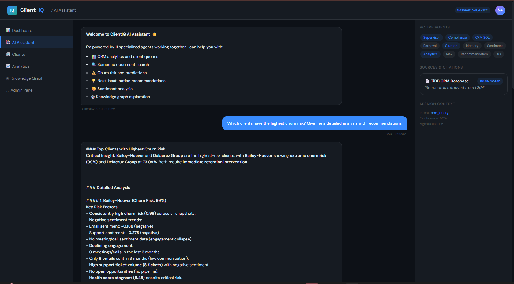
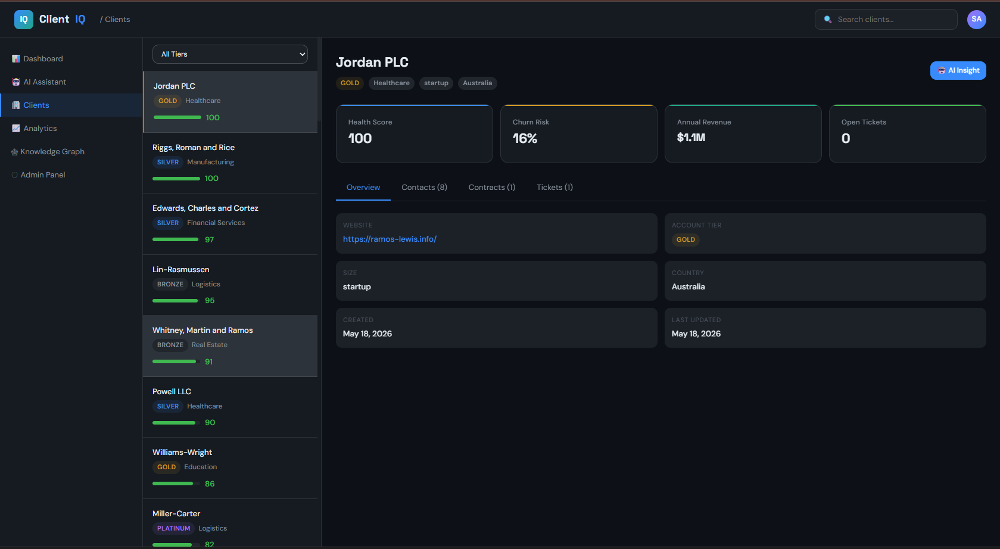
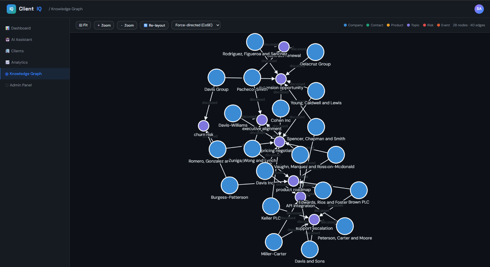
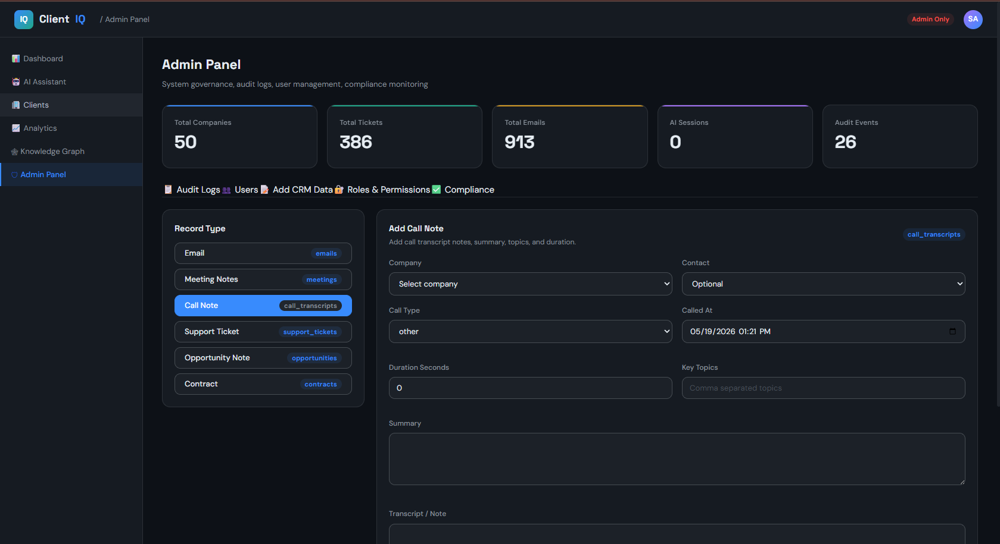

# ClientIQ - Enterprise CRM with AI Agents

## Setup Guide
# ClientIQ — Enterprise Multi-Agent Hybrid RAG Intelligence Platform


ClientIQ is a production-grade, agentic AI platform for enterprise sales and customer success teams. It combines **Hybrid RAG**, **LangGraph multi-agent orchestration**, **TiDB structured storage**, and **Pinecone vector retrieval** to deliver contextual business intelligence.

---

## Demo



| Login | AI Assistant | Clients |
|-------|--------------|---------|
|  |  |  |

| Knowledge Graph | Admin Panel |
|-----------------|-------------|
|  |  |

---

## Architecture Overview

```
User Query
    │
    ▼
┌─────────────────────────────────────────────────────────┐
│                  FastAPI REST Backend                    │
│                  /api/query  /api/analytics              │
└───────────────────────┬─────────────────────────────────┘
                        │
                        ▼
┌─────────────────────────────────────────────────────────┐
│              LangGraph StateGraph Workflow               │
│                                                         │
│  [Supervisor] → [Compliance] → [CRM SQL]                │
│                              → [Retrieval]              │
│                              → [Memory]                 │
│                              → [Sentiment]              │
│                              → [Analytics]              │
│                              → [Risk]                   │
│                              → [Recommendation]         │
│                              → [KnowledgeGraph]         │
│                              → [Citation]               │
│                              → [Final Synthesis]        │
└──────────┬─────────────────────────┬────────────────────┘
           │                         │
    ┌──────▼──────┐           ┌──────▼──────┐
    │   TiDB      │           │  Pinecone   │
    │  (SQL/CRM)  │           │  (Vectors)  │
    └─────────────┘           └─────────────┘
           │                         │
    ┌──────▼──────────────────────────▼──────┐
    │              Mistral AI API             │
    └────────────────────────────────────────┘
```

---

## Quick Start

### Prerequisites

| Tool | Version | Install |
|------|---------|---------|
| Python | 3.11+ | [python.org](https://python.org) |
| Mistral AI | API key | [console.mistral.ai](https://console.mistral.ai) |
| TiDB | Cloud/Local | [tidbcloud.com](https://tidbcloud.com) |
| Pinecone | Account | [pinecone.io](https://pinecone.io) |

### 1. Clone & Install

```bash
git clone https://github.com/your-org/clientiq.git
cd clientiq

python -m venv .venv
source .venv/bin/activate        # Windows: .venv\Scripts\activate
pip install -r requirements.txt
```

### 2. Configure Environment

```bash
cp .env.example .env
# Edit .env with your credentials:
# TIDB_HOST, TIDB_USER, TIDB_PASSWORD
# PINECONE_API_KEY
# MISTRAL_API_KEY
```

### 3. Set Up Mistral AI

Create an API key in the Mistral AI console and set `MISTRAL_API_KEY` in `.env`.
The default hosted model is `mistral-small-latest`.

### 4. Set Up TiDB Database

```bash
# Option A: TiDB Cloud (recommended)
# Create a free cluster at tidbcloud.com and update .env

# Option B: Local TiDB (via Docker)
docker run -d --name tidb -p 4000:4000 pingcap/tidb:latest

# Apply schema
mysql -h $TIDB_HOST -P $TIDB_PORT -u $TIDB_USER -p$TIDB_PASSWORD < backend/database/schema.sql
```

### 5. Seed Synthetic Data

```bash
# Generate and load 50 enterprise accounts with full communications data
python -m data_generation.seed_all

# Outputs:
#   50 companies, 200+ contacts
#   1000+ emails, meetings, calls, tickets, contracts
#   Health snapshots (6 months)
#   Knowledge graph entities
```

### 6. Index Documents in Pinecone

```bash
# Chunk, embed, and upload all documents to Pinecone
python -m data_generation.embed_and_index

# This indexes:
#   Emails, Meeting notes, Call transcripts
#   Support tickets, Contract terms
```

### 7. Launch the API

```bash
uvicorn backend.api.main:app --reload --port 8000

# API docs: http://localhost:8000/api/docs
# Frontend: http://localhost:8000
```

---

## Demo Credentials

| Role | Email | Password | Access |
|------|-------|----------|--------|
| Admin | admin@clientiq.demo | admin123 | Full |
| Manager | manager@clientiq.demo | manager123 | CRM + Financials |
| Analyst | analyst@clientiq.demo | analyst123 | CRM + Analytics |
| Viewer | viewer@clientiq.demo | viewer123 | CRM Read-only |

---

## Project Structure

```
clientiq/
├── backend/
│   ├── agents/          # 11 LangGraph agents
│   ├── graph/           # StateGraph workflow + router
│   ├── api/             # FastAPI routes (6 routers)
│   ├── database/        # TiDB schema, ORM models, connection
│   ├── rag/             # Chunker, Embedder, Pinecone store, Hybrid retriever
│   ├── services/        # Mistral client, Auth, Audit, Graph
│   ├── ml/              # Churn model, Sentiment model
│   └── utils/           # Config, Logger, Helpers
├── data_generation/     # Synthetic data + Pinecone indexer
├── frontend/            # 7 HTML pages + static assets
├── docs/                # Architecture docs
├── requirements.txt
├── .env.example
└── docker-compose.yml
```

---

## Agent Pipeline

| Phase | Agent | Responsibility |
|-------|-------|----------------|
| 1 | **Supervisor** | Query planning, intent classification, final synthesis |
| 1 | **Compliance** | RBAC checks, PII filtering, governance |
| 1 | **CRM SQL** | NL→SQL generation, TiDB execution |
| 1 | **Retrieval** | Pinecone semantic search, hybrid retrieval |
| 1 | **Citation** | Source attribution, confidence scoring |
| 2 | **Memory** | Conversation history, entity context |
| 2 | **Sentiment** | VADER + TextBlob sentiment analysis |
| 2 | **Analytics** | KPI computation, revenue insights |
| 3 | **Risk** | RandomForest churn prediction |
| 3 | **Recommendation** | Next-best-action generation |
| 3 | **Knowledge Graph** | Entity extraction, Cytoscape.js output |

---

## API Reference

| Method | Endpoint | Description |
|--------|----------|-------------|
| POST | `/api/auth/login` | Authenticate and get JWT |
| POST | `/api/query/` | Run AI query through agent pipeline |
| GET  | `/api/analytics/overview` | Dashboard KPIs |
| GET  | `/api/analytics/churn-risk` | Churn risk list |
| GET  | `/api/analytics/revenue-trend` | Revenue over time |
| GET  | `/api/clients/` | List all clients |
| GET  | `/api/clients/{id}` | Client full profile |
| GET  | `/api/graph/` | Cytoscape.js graph data |
| GET  | `/api/admin/audit-logs` | Audit trail |
| GET  | `/api/health` | System health check |

Full interactive docs at `/api/docs`

---

## Tech Stack

| Layer | Technology |
|-------|------------|
| LLM | Mistral AI API |
| Agent Framework | LangChain + LangGraph |
| Vector DB | Pinecone |
| Relational DB | TiDB (MySQL-compatible) |
| ORM | SQLAlchemy (async) |
| API | FastAPI + Uvicorn |
| Embeddings | BAAI/bge-small-en-v1.5 |
| ML | scikit-learn (RandomForest) |
| Sentiment | VADER + TextBlob |
| Knowledge Graph | NetworkX + Cytoscape.js |
| Frontend | HTML5 + CSS3 + Chart.js |
| Data Generation | Faker + custom templates |

---

## Docker Deployment

```bash
docker-compose up --build
# App at http://localhost:8000
# API docs at http://localhost:8000/api/docs
```

---

## Research & Portfolio Use

This project demonstrates:
- **Multi-agent AI orchestration** with LangGraph StateGraph
- **Hybrid RAG** combining dense vector search + structured SQL
- **Enterprise RBAC** and compliance agent patterns
- **ML-based churn prediction** with feature engineering
- **Knowledge graph construction** from unstructured text
- **Production FastAPI** architecture with async ORM

Suitable for: Final year project · AI portfolio · Enterprise AI demos · Research publication · Technical interviews

---

## License

MIT License — free to use for educational and portfolio purposes.
